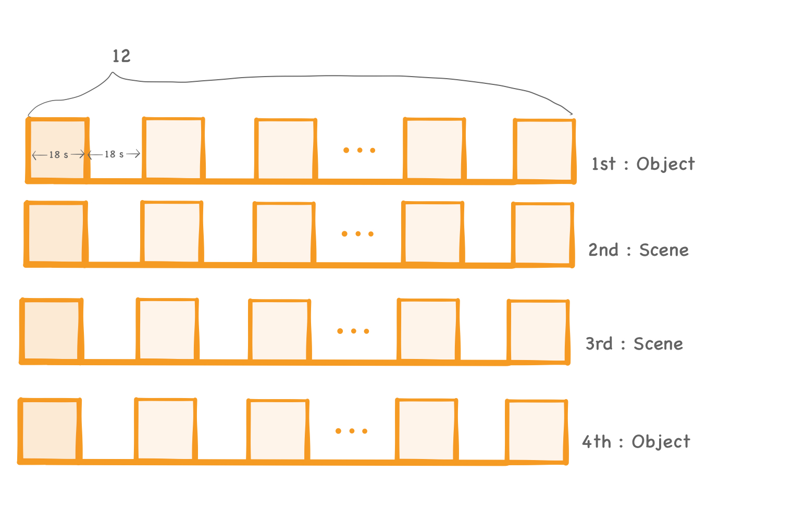
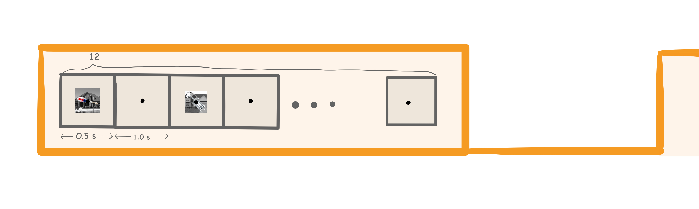
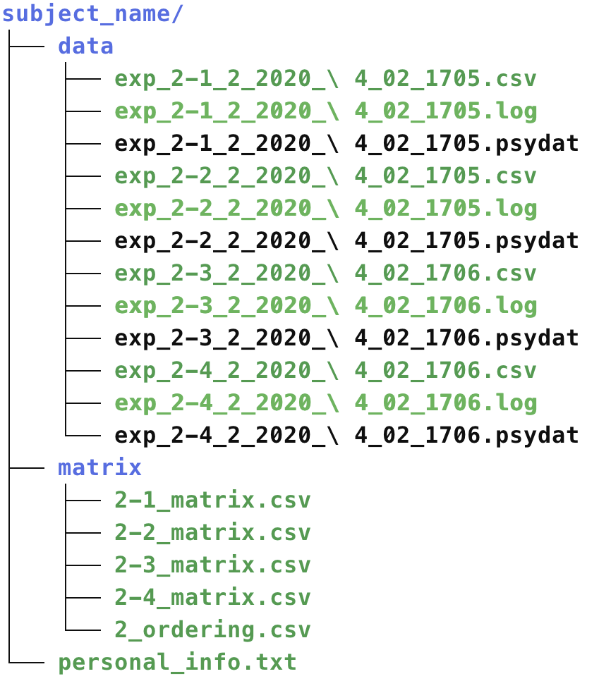

# Scene Object Localizer

**실험목표**


## 1. 실험 구성
---




* 이 실험은 총 4번이 반복됩니다.
* 한 번의 실험마다 Object or Scene 카테고리가 랜덤으로 부여됩니다. 
* 한 실험은 12개의 Block 으로 이루어져 있습니다.
* 한 Block은 18s 입니다.  
* 한 Block이 끝나면 18s 동안 Rest 단계가 있습니다.



* 한 Block에는 12번의 trial이 시행됩니다. 
* 한 trial 에는 Scene 이미지 한장과 Object 이미지 한장이 겹쳐져서 0.5s 동안 출력됩니다.
* 한 trial 이후에는 1s 동안 빈화면이 출력됩니다.
* 이미지는 Scene, Object 각각 12(block) * 12(trial) 144장씩 존재합니다.
* 이미지의 순서는 랜덤합니다.
* target은 한 블럭 안에 최소 1번에서 최대 3번까지 랜덤으로 존재합니다.
* target일때 각 실험의 카테고리에 따라 카테고리에 해당하는 이미지만 직전 이미지와 동일한 이미지가 출력됩니다. 

---

## 2. 실험 준비

### 2-1. Make personal matrix

#### Matrix format

|  <center>Unnamed</center> |  <center>0</center> |  <center>1</center> |  <center>2</center> |  <center>3</center> |  <center>4</center> |<center>5</center> | <center>6</center> | <center>7</center> | <center>8</center> | <center>9</center> | <center>10</center> | 
|:--------|:--------:|--------:|--------:|--------:|--------:|--------:|--------:|--------:|--------:|--------:|--------:|
|**blockID** | <center> 1 </center> |<center> 1 </center> |<center> 1 </center> |<center> 1 </center> |<center> 1 </center> |<center> 1 </center> |<center> 1 </center> |<center> 1 </center> |<center> 1 </center> |<center> 1 </center> |<center> ... </center> |
|**trial** | <center> 1 </center> |<center> 2 </center> |<center> 3 </center> |<center> 4 </center> |<center> 5 </center> |<center> 6 </center> |<center> 7</center> |<center> 8 </center> |<center> 9 </center> |<center> 10 </center> |<center> ... </center> |
|**s_imageID** | <center> 2 </center> |<center> 9 </center> |<center> 28 </center> |<center>14 </center> |<center> 13 </center> |<center> 12 </center> |<center> 32 </center> |<center> 33 </center> |<center> 3 </center> |<center> 13 </center> |<center> ... </center> |
|**o_imageID** | <center> 28 </center> |<center> 19 </center> |<center> 8 </center> |<center> 4 </center> |<center> 1 </center> |<center> 12 </center> |<center> 21 </center> |<center> 13 </center> |<center> 31 </center> |<center> 43 </center> |<center> ... </center> |
|**target_ness** | <center> 0 </center> |<center> 0 </center> |<center> 1 </center> |<center> 0 </center> |<center> 0 </center> |<center> 0 </center> |<center> 1 </center> |<center> 0 </center> |<center> 0 </center> |<center> 0 </center> |<center> ... </center> |
|**onset_time** | <center> 0 </center> |<center> 1.5 </center> |<center> 3 </center> |<center> 4.5 </center> |<center> 6 </center> |<center> 7.5 </center> |<center> 9 </center> |<center> 10.5 </center> |<center> 12 </center> |<center> 13.5 </center> |<center> ... </center> |

* blockID:
* trial:
* s_imageID:
* o_imageID:
* target_ness:
* onset_time:


#### Make matrix.csv file

```
python make_matrix.py [subject_name] [ order ]
```
* 실험은 총 4번이 시행되기 때문에 matrix도 총 4개가 필요 합니다. 
* [ subject_name ] : 해당 subject directory
* [ order ] : 1 부터 4까지의 숫자
* **[subject_name] / matrix** 안에 아래와 같이 **2-1_matrix.csv~ 2-4_matrix.csv** 파일이 만들어집니다

>


### 2-2. Make Ordering matrix

#### Ordering matrix format


|  <center>Unnamed</center> |  <center>0</center> |  <center>0</center> | 
|:--------|:--------:|--------:|
|**0** | <center> 1 </center> |<center> S </center> |
|**1** | <center> 2 </center> |<center> O </center> |
|**2** | <center> 3 </center> |<center> O </center> |
|**3** | <center> 4 </center> |<center> S </center> |

* ordering matrix에는각 n 번째 실험마다 해당하는 카테고리 (Scene or Object) 정보가 들어있습니다. 


#### Make orering.csv file

```
python ordering.py [subject_name]
```

* 네번의 실험에 대한 카테고리를 정해 줍니다.
* **[subject_name] / matrix** 디렉토리 안에 다음과 같이 **2_ordering.csv** 파일이 만들어집니다

>


* 2-SO localizer 실험을 진행할 파일들이 모두 만들어 졌습니다. 이제 실험을 진행해 봅시다.


---

## 3. 실험 진행

### 3-1. Run the executable file

```
python exe_this.py [subject_name] [ order ]
```

* []파일의 정보를 바탕으로 실험이 진행됩니다. 
* **[subject_name] / matrix / 2_ordering.csv** 파일을 이용해 해당 [ order ]의 Scene/ Object trial을 진행합니다. 


### 3-2. Check Data

* 실험 데이터는 **exp_2-[order]** 라는 이름으로  **[subject_name] / data /** 에 저장됩니다.


>

---
