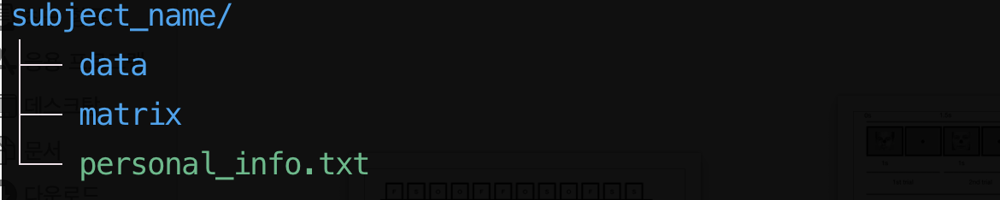

# Subject

여기서는 실험자 개개인의 폴더를 생성하고 폴더 안에서 각 실험자의 데이터를 관리합니다.

## 1. subject directory 생성

* make_subdir.sh 를 이용하여 subject directory를 생성합니다. 

```
bash make_subdir.sh [directory name]
```
* 'test_01'이라는 이름으로 subject directory를 생성하면 하위 폴더가 다음과 같이 만들어집니다.

> 

### personal_info.txt

* 실험자에 대한 정보를 저장합니다. 

### data 

* 각 실험에 대한 결과가 data 에 저장됩니다.

### matrix

* 각 실험에 필요한 정보가 들어있는 개인별 matrix가 csv 파일 형식으로 저장됩니다. 
